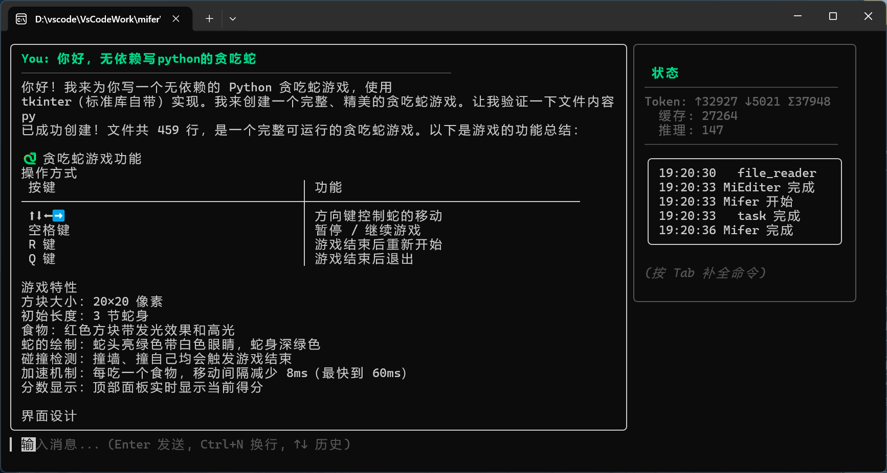

# Mifer — AI Agent Bot

基于 [CloudWeGo Eino](https://github.com/cloudwego/eino) 构建的智能 AI Agent，支持多 Agent 编排、流式对话、工具调用与 CLI / Web 双模交互。

> **一句话定位：** 一个可编程、可扩展的桌面级 AI 助手，既提供开箱即用的终端对话体验，也为开发者提供 Agent 编排与 MCP/Skills 扩展框架。



---

## 为什么做这个项目

现有 AI 助手产品功能丰富但封闭，开发者难以定制 Agent 行为或接入私有工具。Mifer 将 Agent 编排从 Web 端下沉到本地，提供一个**透明、可控、可扩展**的 AI 助手底座——你既可以直接使用 CLI 对话，也可以按需接入自己的工具链和业务系统。

核心设计目标：
- **本地优先** — 对话记忆存本地 JSONL，零依赖即可运行，数据完全自主
- **可编排** — 基于 Eino ADK 的多 Agent 协作，按任务复杂度自动路由到不同模型
- **可扩展** — Registry 模式管理多 LLM 后端，统一接口接入 OpenAI / Claude / Gemini / Ollama

---

## 快速开始

### 环境要求

- Go 1.25+

### 安装运行

```bash
git clone <repo-url> mifer
cd mifer
go mod tidy

# 开发模式（默认端口 8080，同时启动 HTTP 服务 + CLI）
go run ./cmd/main

# 仅启动 HTTP 服务
go run ./cmd/main serve

# 仅启动 CLI（需先启动服务）
go run ./cmd/main chat

# 生产模式
MIFER_ENV=prod go run ./cmd/main serve
```

### 配置

首次运行自动生成默认配置文件：

| 模式   | 路径                            |
| ------ | ------------------------------- |
| dev    | `./config/dev.yaml`             |
| prod   | `~/.mifer/config/prod.yaml`     |

关键环境变量（优先级高于配置文件）：

| 变量名                  | 说明                       |
| ----------------------- | -------------------------- |
| `MIFER_AI_BASEURL`      | AI API 地址                |
| `MIFER_AI_APIKEY`       | AI API 密钥                |
| `MIFER_AI_MODEL`        | 默认模型名称               |
| `MIFER_JWT_SECRET`      | JWT 签名密钥               |
| `MIFER_ENV`             | 运行模式（dev / prod）     |

完整的配置项与后端模型管理详见配置文件。

---

## 功能一览

### Agent 对话

- 多 LLM 后端支持：OpenAI 兼容协议 / Claude / Gemini / Ollama，统一 ChatModel 接口
- 三级模型分配（haiku / sonnet / opus），按任务复杂度路由，平衡成本与质量
- 流式 SSE 响应，实时逐词输出，推理过程可见

### 多 Agent 编排

- Eino ADK Orchestrator 协调主 Agent（Mifer）与子 Agent（MiTalker），最大 3 轮迭代
- Agent、ChatModel、Tool 之间接口解耦，通过 `internal/domain` 的抽象层隔离依赖
- 所有 Agent 通过统一的 `adk.Runner` 启动，自动处理流式 / 非流式消息并追加记忆

### 工具调用

- 完整的 Function Calling / Tool Use 流程，模型可自主决定调用时机与参数
- 工具注册在 `internal/ai/tool/` 中集中管理，支持运行时按需注入

### 对话记忆

- JSONL 文件持久化，锁安全 + 增量追加写入，零外部依赖
- 多会话隔离，基于 workdir 哈希的会话 ID 自动生成
- 服务层统一管理记忆的读取、追加、保存，对上层透明

### CLI 客户端

- **TUI 模式**：Bubble Tea 全屏终端界面，支持鼠标操作
- **Markdown 渲染**：Glamour 引擎，代码块语法高亮 + 表情符号 + 表格
- **流式展示**：消息实时追加，推理过程以动画呈现（Thinking... 指示器）
- **会话管理**：`/viewmemory` 查看历史，`/excmem` 切换会话
- **可配置样式**：lipgloss 主题色、消息样式、滚动指示器均支持自定义

### 工程基础

- 结构化日志（Uber Zap）：按级别分文件输出，dev 模式控制台彩色、prod 模式 JSON
- JWT 认证：中间件已实现，路由可选启用
- CI/CD：GitHub Actions，Tag 推送自动构建 Windows / Linux 多架构二进制

---

## 核心设计决策

### 1. 为什么自建记忆而非依赖框架内置 Memory？

Eino ADK 自带内存记忆，但它绑定于进程生命周期，重启即丢失。Mifer 自建 JSONL 文件记忆层，**增量追加 + 锁保护并发写入**，兼具零依赖的部署便利性和持久性。同时通过 `internal/domain.AgentService` 接口隔离记忆实现，后续可平滑切换为 SQLite 或向量数据库。

### 2. LLM 后端为什么用 Registry 模式？

项目需要同时接入多个模型（日常用 DeepSeek，复杂任务用 Claude，本地测试用 Ollama），且各提供商的 ChatModel 创建方式不同。Registry 模式将模型实例按名称索引（default/haiku/sonnet/opus/multi_modal），业务代码通过 `registry.Get("sonnet")` 获取，**切换模型不改业务代码**。缺失后端自动 fallback 到 default，保证可用性。

### 3. 为什么 Agent 编排设 0 轮迭代？

当前是自主任务执行 Agent。0 轮迭代，由模型自主控制迭代次数，避免无限反思循环和出现迭代次数超出而错误。

---

## 架构

```
┌─────────────────────────────────────────────┐
│                  cmd / bootstrap             │
│              (入口 + 依赖装配)                 │
├─────────────────────────────────────────────┤
│               internal/api                   │
│    routes → handler → dto (HTTP 层)          │
├─────────────────────────────────────────────┤
│             internal/service                 │
│       AgentService (业务编排 + 记忆管理)       │
├─────────────────────────────────────────────┤
│               internal/ai                    │
│   agent / executor / llm / memory / tool     │
│        (AI 核心，不含 HTTP 依赖)              │
├─────────────────────────────────────────────┤
│                  pkg                         │
│   conf / logger / auth / res / utils ...    │
│          (公共基础包，无业务依赖)               │
└─────────────────────────────────────────────┘
```

分层依赖：`cmd` → `api` → `service` → `ai` → `pkg`，每层只依赖下层，`pkg` 完全不依赖 `internal`。

---

## 项目结构

```
mifer/
├── cli/                       # CLI 客户端
│   ├── client/                #   HTTP API 调用
│   ├── render/                #   终端渲染（Glamour + Lip Gloss）
│   └── tui/                   #   TUI 界面（Bubble Tea）
├── cmd/
│   ├── main/                  #   服务主入口
│   └── bootstrap/             #   启动引导（配置→日志→路由→CLI）
├── config/
│   └── dev.yaml               #   开发环境配置（自动生成）
├── internal/
│   ├── ai/
│   │   ├── agent/             #   Eino ADK 多 Agent 编排
│   │   ├── executor/          #   adk.Runner 包装器
│   │   ├── llm/               #   多后端 ChatModel 管理（Registry）
│   │   ├── memory/            #   JSONL 对话记忆持久化
│   │   └── tool/              #   Function Calling 工具定义
│   ├── api/
│   │   ├── dto/               #   请求 / 响应 DTO
│   │   ├── handler/           #   HTTP Handler（chat / memory）
│   │   ├── middlewares/       #   JWT 认证 + CORS
│   │   └── routes/            #   Gin 路由注册
│   ├── domain/                #   核心接口（AgentService、Agent）
│   └── service/               #   业务编排层
├── pkg/
│   ├── auth/                  #   JWT Token
│   ├── conf/                  #   Viper 配置管理（全局单例）
│   ├── errorer/               #   统一错误码
│   ├── logger/                #   Uber Zap 日志封装
│   ├── res/                   #   统一 HTTP 响应格式
│   └── task/                  #   异步任务管理
├── .github/workflows/         #   CI/CD
└── docs/screenshots/          #   截图（请在此添加实际截图）
```

---

## 技术栈

| 组件     | 选型                                  | 说明                        |
| -------- | ------------------------------------- | --------------------------- |
| 语言     | Go 1.25                               |                             |
| HTTP     | Gin v1.12                             | 轻量高性能路由                |
| AI 编排  | CloudWeGo Eino v0.8 (ADK)             | 字节跳动开源 Agent 框架       |
| 默认模型 | DeepSeek V4                           | OpenAI 兼容协议              |
| TUI      | Bubble Tea + Bubbles                  | Elm 架构的终端 UI 框架       |
| 终端渲染 | Glamour + Lip Gloss                   | Markdown + 声明式样式        |
| 日志     | Uber Zap                              | 结构化、高性能                |
| 配置     | Viper                                 | 多源配置 + 环境变量覆盖       |
| 认证     | JWT                                   | 无状态 Token 认证            |
| CI/CD    | GitHub Actions                        | Tag 触发多架构构建            |

---

## 后续方向

- MCP 协议支持（Client / Server），接入第三方工具生态
- Skills 技能系统，支持 YAML 声明式自定义技能
- RAG 检索增强，本地代码库语义索引
- Web UI 管理面板
- Docker 一键部署
